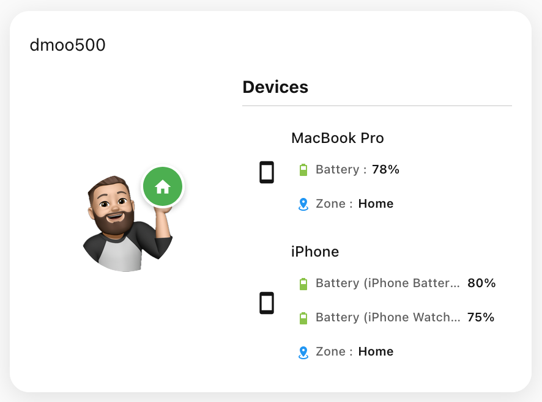

# Enhanced Person Card

[](https://github.com/hacs/integration)
[](https://github.com/dmoo500/ha-enhanced-person-card/releases)
[](LICENSE)

An advanced person card for Home Assistant with intelligent device tracking, comprehensive sensor integration, and responsive grid layout support.

## ✨ Key Features

- **👤 Advanced Person Tracking**: Intelligent display of person entities with comprehensive location and device information
- **📱 Smart Device Integration**: Automatically detects and displays all associated device trackers with their sensors
- **🎨 Customizable Attributes**: Configurable display of battery level, GPS accuracy, zones, and more device-specific data
- **📐 Responsive Grid Layout**: Native Home Assistant grid support with automatic icon sizing for any dashboard layout
- **🔧 Visual Configuration**: Easy setup through the Home Assistant UI editor
- **🚫 Flexible Device Management**: Exclude unwanted device trackers and customize which attributes to display

## 📱 Screenshots

with Name



without Name


## 📦 Installation

### HACS (Recommended)

[](https://my.home-assistant.io/redirect/hacs_repository/?owner=dmoo500&repository=ha-enhanced-person-card&category=frontend)

1. Open HACS in Home Assistant
2. Go to "Frontend" 
3. Click the three dots menu → "Custom repositories"
4. Add repository URL: `https://github.com/dmoo500/ha-enhanced-person-card`
5. Category: Lovelace
6. Install the "Enhanced Person Card"
7. Restart Home Assistant
8. Add the card resource to your dashboard

### Manual
1. Download the latest `enhanced-person-card.js` from [Releases](https://github.com/dmoo500/ha-enhanced-person-card/releases)
2. Copy it to your `config/www/` folder (so the path is `/config/www/enhanced-person-card.js`)
3. In Home Assistant, go to **Settings → Dashboards → More Options (⋮) → Resources**
4. Click **Add Resource** and enter:
   - **URL:** `/local/enhanced-person-card.js`
   - **Type:** `module`
5. Click **Create** and reload the dashboard (or restart Home Assistant if required)
6. Now add a new card to your dashboard:
   - Click **Edit Dashboard**
   - Click **Add Card**
   - Search for **SwissWeather Card** or choose **Custom: SwissWeather Card**
   - Configure the card as desired and save

## ⚙️ Configuration

### Basic Configuration

```yaml
type: custom:enhanced-person-card
entity: person.john_doe
```

### Advanced Configuration

```yaml
type: custom:enhanced-person-card
entity: person.john_doe
name: "John Doe"
show_name: true
show_state: true  
show_devices: true
badge_style: icon_text
device_attributes:
  - battery_level
  - gps_accuracy
  - source_type
  - zone
excluded_entities:
  - device_tracker.old_phone
grid_options:
  rows: 2
  columns: 3  # or "full" for full width
```

## 🔧 Configuration Options

| Option | Type | Default | Description |
|--------|------|---------|-------------|
| `entity` | string | **Required** | Person entity ID |
| `name` | string | Entity Name | Custom display name |
| `image` | string | Entity Picture | Custom image URL |
| `icon` | string | `mdi:account` | Fallback icon when no image |
| `show_name` | boolean | `true` | Display person name |
| `show_state` | boolean | `true` | Show location status badge |
| `show_devices` | boolean | `true` | Display device list |
| `badge_style` | string | `icon_text` | Badge style options |
| `device_attributes` | array | `[battery_level, gps_accuracy, source_type]` | Attributes to display |
| `excluded_entities` | array | `[]` | Device trackers to exclude |
| `grid_options` | object | `{rows: 1, columns: 1}` | Grid layout configuration |

### Badge Style Options

- `icon_text` - Show icon and text (default)
- `icon_only` - Show only icon in circular badge
- `text_only` - Show only text

### Available Device Attributes

| Attribute | Description | Example Display |
|-----------|-------------|-----------------|
| `battery_level` | Battery percentage | `85%` |
| `gps_accuracy` | GPS accuracy in meters | `12m` |
| `source_type` | Connection type | GPS, Bluetooth, Router |
| `zone` | Current zone/location | Home, Work, Away |
| `last_seen` | Last seen timestamp | `14:30:25` |
| `ip` | IP address | `192.168.1.100` |
| `hostname` | Device hostname | `Johns-iPhone` |
| `mac` | MAC address | `AA:BB:CC:DD:EE:FF` |
| `latitude` | Latitude coordinate | `52.5200°` |
| `longitude` | Longitude coordinate | `13.4050°` |
| `altitude` | Altitude in meters | `45m` |
| `course` | Direction in degrees | `180°` |
| `speed` | Speed in km/h | `25 km/h` |

## 🏗️ Grid Layout System

The card supports Home Assistant's native grid layout with intelligent responsive sizing:

### Standard Grid Layouts
```yaml
grid_options:
  rows: 1        # Height (1-4 recommended)
  columns: 1     # Width (1-12)
```

### Full-Width Layout
```yaml
grid_options:
  rows: 2
  columns: full  # Spans entire container width
```

### Responsive Icon Sizing

The card automatically adjusts icon and element sizes based on the grid configuration:
- **1-2 columns**: Large icons (60-120px)
- **3-5 columns**: Medium icons (80-140px) 
- **6-8 columns**: Compact icons (40-90px)
- **9+ columns / full**: Small icons (30-60px)

## 🎨 Visual Examples

### Single Column Layout
Ideal for sidebar or compact displays with larger icons and full device information.

### Multi-Column Layout  
Perfect for main dashboard areas with balanced icon sizes and comprehensive device data.

### Full-Width Layout
Optimized for wide dashboard sections with compact icons and maximum information density.

## 🐛 Troubleshooting

### Common Issues

**Problem**: Duplicate battery levels showing for similar device names
**Solution**: The card automatically prevents cross-device sensor assignment using device IDs and strict name matching.

**Problem**: Icons too large in wide layouts
**Solution**: Use `columns: 9` or higher for automatic size reduction, or `columns: full` for optimal wide layout display.

**Problem**: Device not showing expected sensors
**Solution**: Check device attributes are available and not excluded. Use browser console (F12) to see debug information.

### Debug Information

Enable browser console logging (F12) to see:
- `[Device Processing]` - Device detection and sorting
- `[Sensor Matching]` - Sensor-to-device assignment details  
- `[Grid Layout]` - Responsive sizing calculations

## 🤝 Contributing

Contributions are welcome! Please:

1. Fork the repository
2. Create a feature branch: `git checkout -b feature/amazing-feature`
3. Commit changes: `git commit -m 'Add amazing feature'`
4. Push to branch: `git push origin feature/amazing-feature`
5. Open a Pull Request

### Development Setup

```bash
# Clone repository
git clone https://github.com/dmoo500/ha-enhanced-person-card.git
cd ha-enhanced-person-card

# Install dependencies
yarn install

# Build for development
yarn build

# Watch for changes
yarn dev
```

## 📄 License

This project is licensed under the MIT License - see the [LICENSE](LICENSE) file for details.

## ⭐ Support

If you find this card useful, please consider:
- ⭐ Starring the repository
- 🐛 Reporting issues on [GitHub](https://github.com/dmoo500/ha-enhanced-person-card/issues)
- 💡 Suggesting new features
- 🤝 Contributing improvements

## 🔗 Related Projects

- [Home Assistant](https://home-assistant.io/) - Open source home automation
- [HACS](https://hacs.xyz/) - Home Assistant Community Store
- [Lovelace](https://www.home-assistant.io/lovelace/) - Home Assistant dashboard system